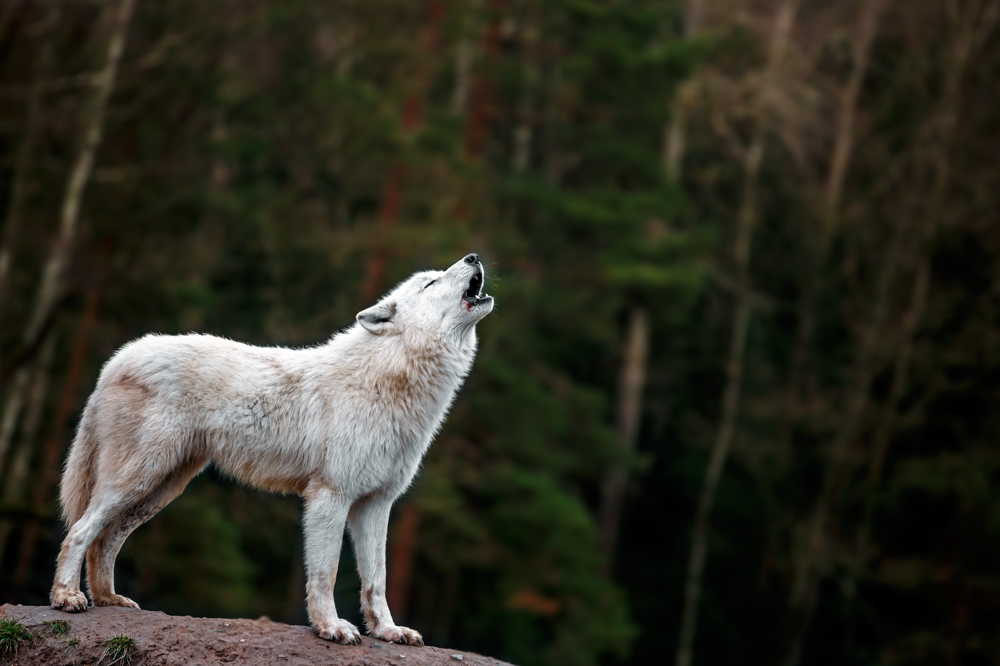

# Wolves

## __Description__

a big pack of wolves

## __Table of Contents__

- [Installation](#installation)

- [Usage](#usage)

- [Credits](#credits)

- [License](#license)

- [Features](#features)

- [How to Contribute](#howtocontribute)

- [Tests](#tests)

- [Questions](#questions)

- [Credits](#credits)

## __Installation__

you don't

## __Usage__
  

    
you can't

## __License__

 

## __Features__

scars and free piercings

## __How to Contribute__

BYOB

## __Tests__

none

## __Questions__

If you have any additional questions, feel free to reach out to me on GitHub
or through my e-mail. 

- <a href="https://github.com/IvySMac">GitHub</a>

- <a href="mailto:ivy.mccurdy@yahoo.com">ivy.mccurdy@yahoo.com</a>

## __Credits__

none

    